<p align="center">
  
</p>

```text
┌───────────────────────────────────────────────────┐
│ role      ingeniería civil informática (en curso) │
│ focus     software · frontend · ia · datos        │
│ building  mapa de campus en react + typescript    │
│ learning  análisis de datos · agentes de ia       │
│ location  chile                                   │
└───────────────────────────────────────────────────┘
```

Estoy en el tramo en que aprender a programar deja de ser el objetivo y pasa a ser la
herramienta: me interesa que lo que construyo tenga una arquitectura que se pueda
sostener, decisiones que pueda defender y una interfaz que alguien más quiera usar.

<p align="center">
  
</p>

## ~/construyendo

**[Mapa de Campus UCT](https://github.com/sofiarodrigueznog/test-mapa)** · navegación e información para los campus de la universidad<br>
Corre sobre los planos isométricos oficiales con Leaflet en `CRS.Simple`: las coordenadas
del dominio son píxeles del plano y no latitud/longitud. Es una decisión con costo — no
hay GPS real — a cambio de conservar la identidad visual de los planos y llegar al detalle
de sala. Las rutas peatonales se resuelven con **Dijkstra** sobre un grafo de caminos, y
la conversión entre sistemas de coordenadas vive aislada en un módulo, para que un error
de proyección tenga un solo lugar donde buscarse. 55 pruebas.<br>
`React 19` `TypeScript` `Vite` `Tailwind` `Leaflet` `TanStack Query` `Zustand` `Zod` `Vitest`

**[Urban Node](https://github.com/sofiarodrigueznog/Urban-Node-Entrega-3)** · armario digital con cuentas de usuario<br>
Registro y sesión, CRUD completo de prendas contra MySQL, subida de imágenes al servidor y
formularios que viajan por `fetch` + JSON. Fue mi primer sistema con estado real del lado
del servidor: sesiones, archivos y una base que sobrevive al refresh.<br>
`PHP` `MySQL` `JavaScript` `HTML` `CSS`

**Sistema de restaurante** · `repositorio privado`<br>
Clientes, menús, ingredientes y pedidos modelados con SQLAlchemy sobre SQLite, con las
relaciones y restricciones declaradas en los modelos. La emisión de boletas en PDF queda
detrás de un **Facade**, así que el resto del sistema no conoce el detalle del formato, y
los gráficos de ventas y consumo se calculan sobre esas mismas entidades.<br>
`Python` `SQLAlchemy` `pandas` `matplotlib` `CustomTkinter`

## ~/stack

Solo lo que he usado en los proyectos de arriba.

| área | herramientas |
|---|---|
| **lenguajes** | `TypeScript` `JavaScript` `Python` `PHP` `SQL` `HTML` `CSS` |
| **frontend** | `React` `React Router` `Vite` `Tailwind CSS` `TanStack Query` `Zustand` `Zod` `React Hook Form` `Leaflet` |
| **datos** | `MySQL` `SQLite` `SQLAlchemy` `pandas` `matplotlib` |
| **calidad** | `Vitest` `oxlint` `TypeScript` en modo estricto |
| **criterio** | patrones de diseño · separación de responsabilidades · modelado de datos |

## ~/aprendiendo

```text
aprendiendo/
├── datos/       análisis y visualización · Google Data Analytics
├── ia/          agentes conectados a bases de datos empresariales
├── software/    clean code · SOLID · patrones de diseño
└── frontend/    interfaces accesibles · arquitectura de componentes
```

No es una lista de cursos por completar: cada rama entra a los proyectos apenas la
entiendo lo suficiente como para defender la decisión.

<!-- TODO (Sofía): si quieres, agrega acá tus enlaces de contacto. Por ejemplo:
     [LinkedIn](https://www.linkedin.com/in/tu-usuario) · [correo](mailto:tu@correo.cl)
     No dejo ninguno puesto para no inventar datos. -->

---

<sub>El encabezado y el calendario son SVG generados por
<a href="scripts/build.py"><code>scripts/build.py</code></a> con la librería estándar de
Python: sin dependencias, sin servicios externos y sin token. Un
<a href=".github/workflows/activity.yml">workflow diario</a> los redibuja y publica
únicamente cuando la actividad cambió.</sub>
