<a href="https://github.com/sofiatrops/Benthos">benthos</a> ·
<a href="https://github.com/sofiarodrigueznog/test-mapa">mapa uct</a> ·
<a href="https://github.com/sofiatrops/EID-Algebra-Lineal">buscador</a> ·
<a href="https://github.com/sofiatrops/EID-Calculo-Grupo-10">cónicas</a>
 
lo de universidad vive en <a href="https://github.com/sofiatrops">@sofiatrops</a>
&nbsp;&nbsp;·&nbsp;&nbsp;
equipo en <a href="https://github.com/The-Quaintum-Hub">@The-Quaintum-Hub</a>

<!-- TODO (Sofía): si quieres, agrega acá tus enlaces de contacto.
     No dejo ninguno puesto para no inventar datos. -->

---

SVG dibujados por <a href="scripts/build.py"><code>scripts/build.py</code></a> con
la librería estándar de Python · calendario real, sin token ni servicios externos ·
<a href=".github/workflows/activity.yml">workflow</a> diario
